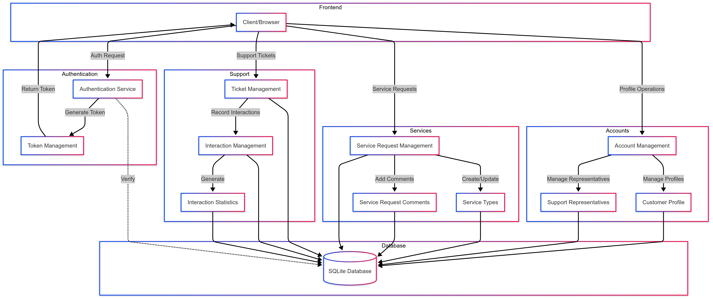

# Gas Utility Service Application

A Django-based REST API for managing gas utility customer service requests. This application allows customers to submit service requests online, track request status, and enables customer support representatives to manage requests efficiently.



## Features

- Customer account management
- Service request submission and tracking
- Support ticket management
- Customer interaction tracking
- Role-based access control

## Technology Stack

- Python 3.x
- Django 5.2
- Django REST Framework
- SQLite (default database)

## Project Structure

```
gas_utility_service/
├── accounts/           # User and profile management
├── services/          # Service request handling
├── support/           # Customer support functionality
└── gas_utility_service/  # Project settings
```

## Installation

1. Clone the repository
2. Create a virtual environment:
   ```bash
   python -m venv venv
   source venv/bin/activate  # On Windows: venv\Scripts\activate
   ```
3. Install dependencies:
   ```bash
   pip install -r requirements.txt
   ```
4. Apply migrations:
   ```bash
   python manage.py migrate
   ```
5. Create a superuser:
   ```bash
   python manage.py createsuperuser
   ```
6. Run the development server:
   ```bash
   python manage.py runserver
   ```

## Authentication

The API uses token-based authentication. To get your authentication token:

1. Create a user account through the admin interface or API
2. Get your token by making a POST request to:
   ```
   POST /api/token/
   {
       "username": "your_username",
       "password": "your_password"
   }
   ```
3. The response will include your token:
   ```json
   {
       "token": "your-auth-token",
       "user_id": 1,
       "email": "user@example.com",
       "is_staff": false
   }
   ```
4. Include the token in all API requests in the Authorization header:
   ```
   Authorization: Token your-auth-token
   ```

Alternative method to get token:
```
POST /api/accounts/customers/get_token/
```
This endpoint requires you to be already authenticated (e.g., through session authentication).

## API Endpoints

For detailed API documentation, see the [API Examples](docs/API_EXAMPLES.md) file.

### Accounts

- `GET /api/accounts/customers/` - List all customers
- `POST /api/accounts/customers/` - Create new customer
- `GET /api/accounts/customers/{id}/` - Retrieve customer details
- `GET /api/accounts/customers/my_profile/` - Get current user's profile
- `GET /api/accounts/representatives/` - List support representatives
- `GET /api/accounts/representatives/available_representatives/` - List available representatives

### Services

- `GET /api/services/types/` - List service types
- `POST /api/services/requests/` - Create service request
- `GET /api/services/requests/` - List service requests
- `GET /api/services/requests/{id}/` - Get request details
- `POST /api/services/requests/{id}/update_status/` - Update request status
- `POST /api/services/requests/{id}/assign/` - Assign request to representative
- `GET /api/services/requests/{id}/comments/` - List request comments
- `POST /api/services/requests/{id}/comments/` - Add comment to request

### Support

- `GET /api/support/tickets/` - List support tickets
- `POST /api/support/tickets/` - Create support ticket
- `GET /api/support/tickets/{id}/` - Get ticket details
- `POST /api/support/tickets/{id}/resolve/` - Resolve ticket
- `GET /api/support/interactions/` - List customer interactions
- `POST /api/support/interactions/` - Record new interaction
- `GET /api/support/interactions/recent_interactions/` - Get recent interactions
- `GET /api/support/interactions/interaction_stats/` - Get interaction statistics


## Permissions

- Customers can view and manage their own service requests and interactions
- Support representatives can manage all service requests and support tickets
- Admin users have full access to all endpoints

## Error Handling

The API returns appropriate HTTP status codes:
- 200: Success
- 201: Created
- 400: Bad Request
- 401: Unauthorized
- 403: Forbidden
- 404: Not Found
- 500: Internal Server Error

## Data Models

### Customer Profile
- User information (name, email)
- Customer ID
- Contact information
- Address

### Service Request
- Customer reference
- Service type
- Description
- Status (Pending, In Progress, Completed, Cancelled)
- Priority
- Attachments
- Timestamps

### Support Ticket
- Service request reference
- Status
- Priority
- Resolution notes
- Assignment details

### Customer Interaction
- Support ticket reference
- Interaction type
- Duration
- Notes
- Timestamps
